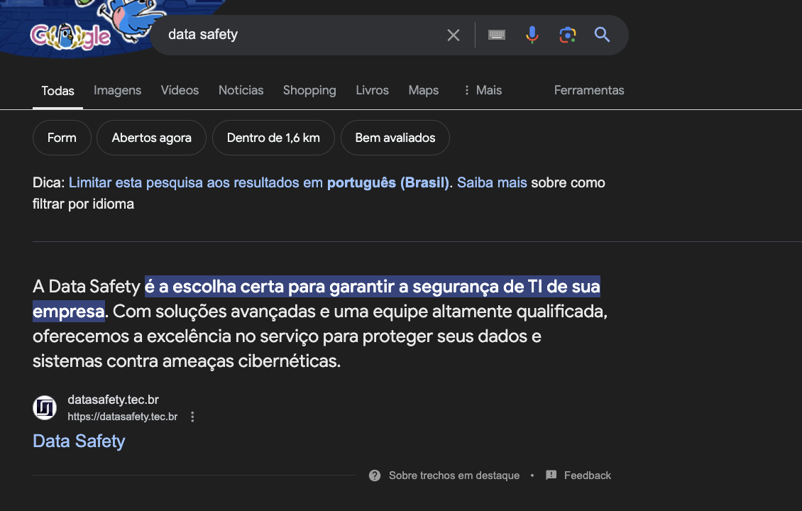

# Data Safety - Ensuring Your Digital Security

Welcome to the official repository of the Data Safety website, a project dedicated to showcasing the services and expertise of a digital security company.

## Overview

Data Safety is a digital security company focused on providing top-notch solutions to protect your data. The website is designed to effectively communicate their services and the value they offer to clients. This project was developed by me as a pro bono effort for a friend, and while the current URL is temporary for showcasing purposes, the original domain is owned by the company founders.

### Custom UI Design by Me

The user interface was designed by me to provide an intuitive and engaging user experience, highlighting the company’s expertise and services.

### High Lighthouse Scores

While not perfect, the site achieves high scores on Lighthouse benchmarks, averaging 98 across SEO, accessibility, performance, and best practices, ensuring a reliable and efficient user experience.

### Google Search Ranking

Ranked first on Google search results, demonstrating the effectiveness of our SEO strategy and the relevance of the site content.

### Social Media Meta Tags (aka Open Graph)

## Tech Stack

- Next.js 14: Utilizes the latest version of Next.js, leveraging its powerful features for optimal performance and scalability.
